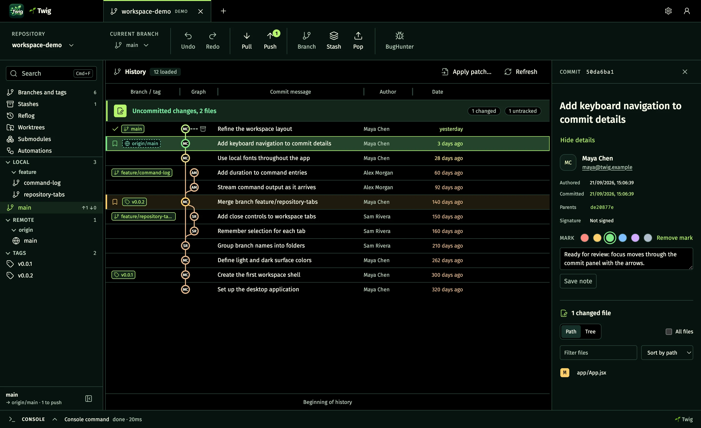
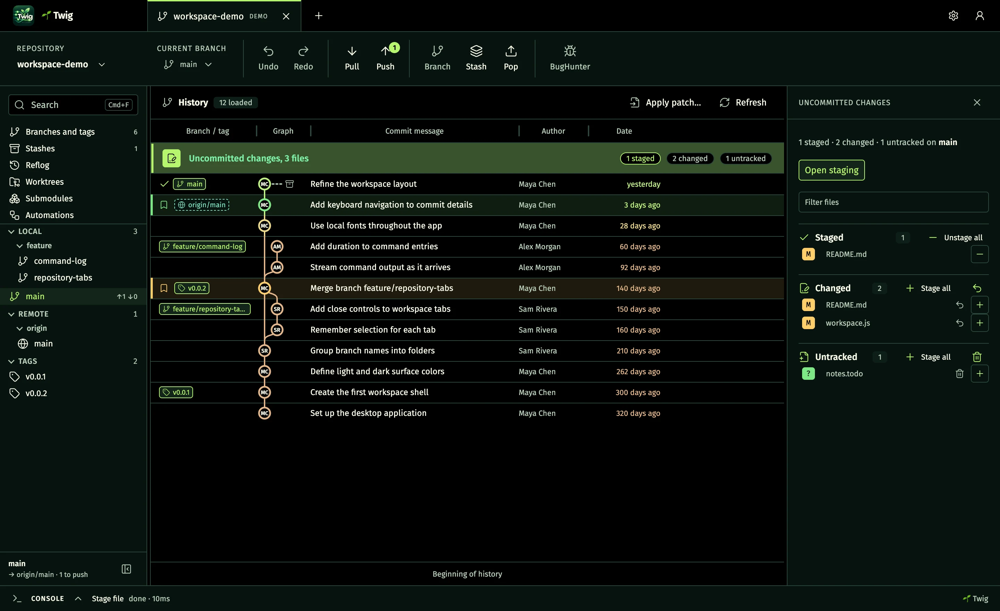
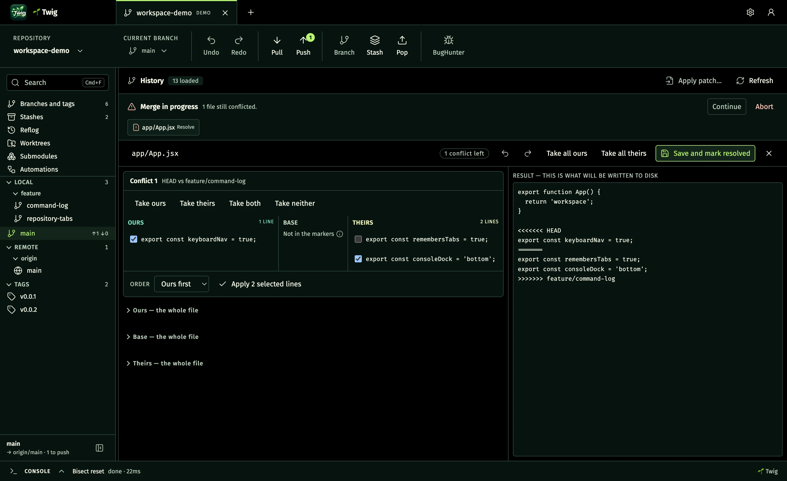
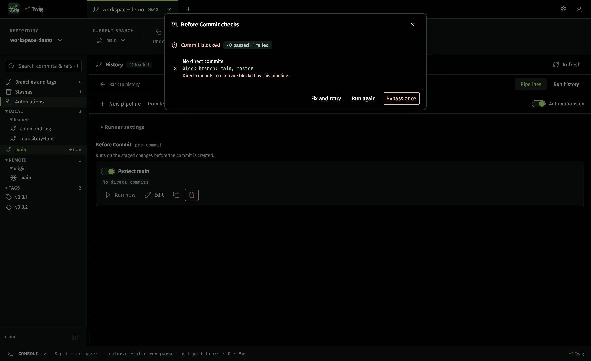
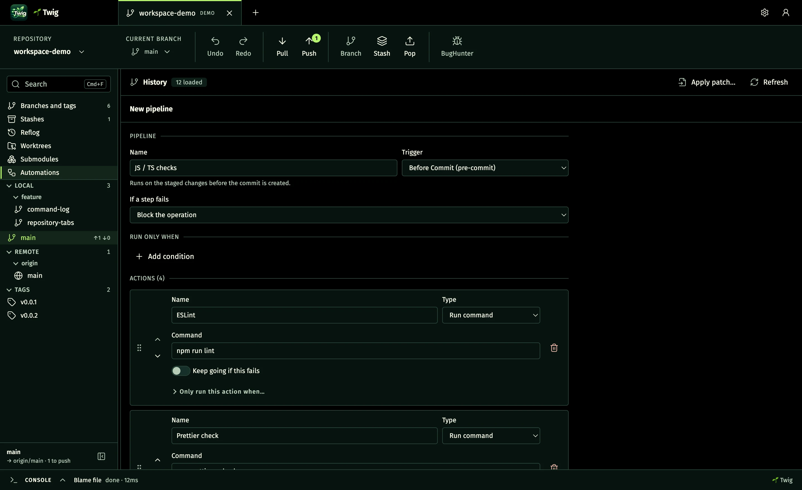
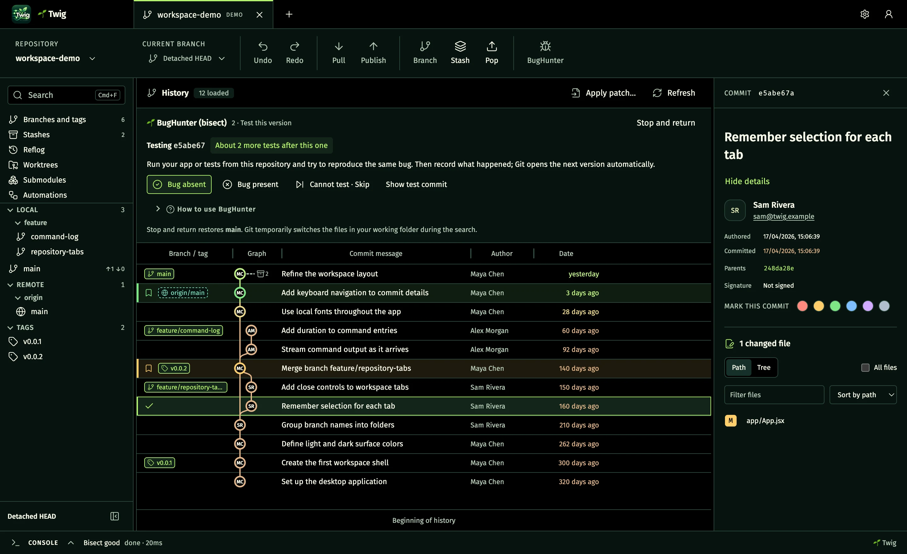
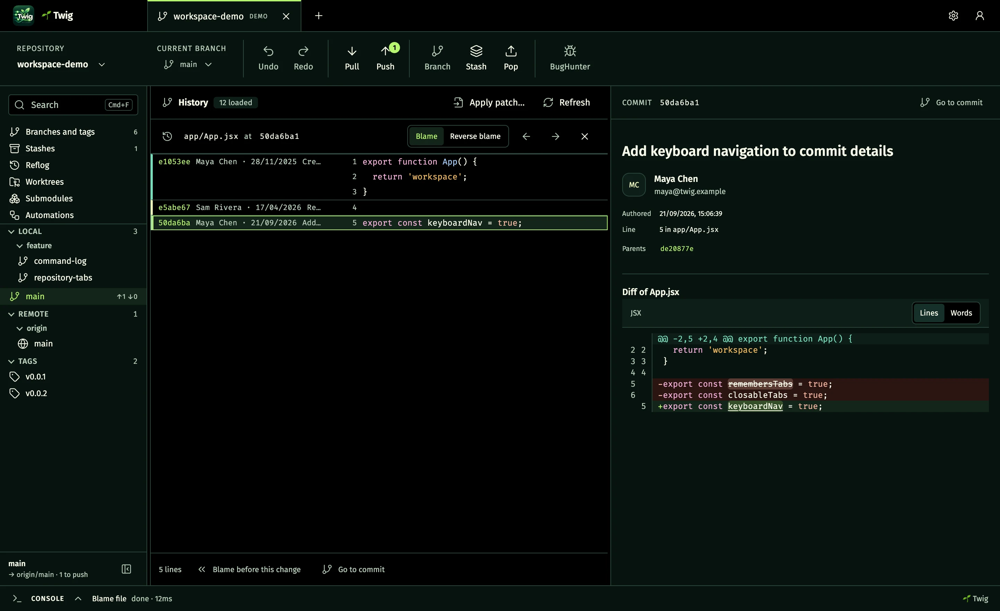
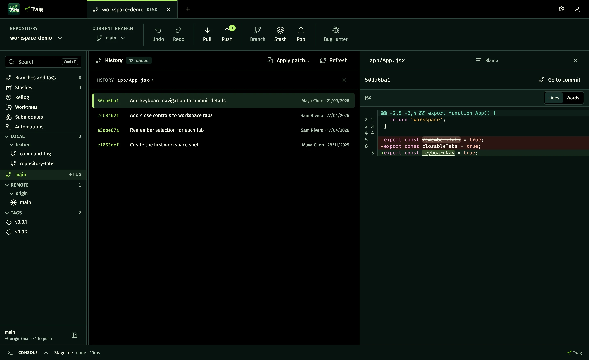
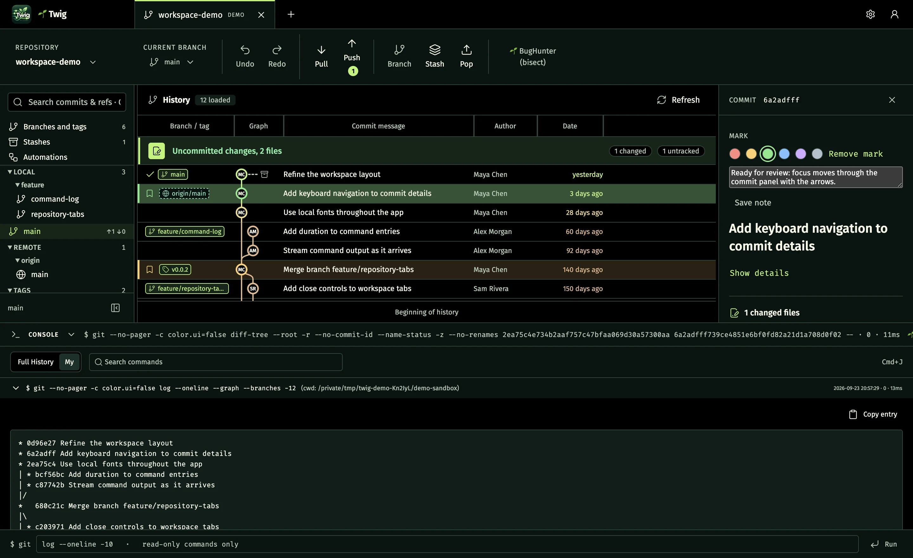

# 🌱 Twig

A standalone desktop Git client for macOS, Windows and Linux, built on Electron +
React 18 + Vite (plain JavaScript ESM, Node 20). The workspace puts the commit
history in the center, repository navigation on the left, commit details on the
right, and a command console below — everything the app runs against Git is
visible there, exactly as it was invoked.

**Current version: 0.13.0.** Released 2026-09-24 — what appeared in each release
is listed in [CHANGELOG.md](CHANGELOG.md). This repository was split out of the private
`nodes-managers` monorepo (`modules/git_desk`) with `git subtree split`; the
M0…M6 history is preserved. `PROMPT.md` is the full specification and `CLAUDE.md`
records the current handoff state.

**Website:** <https://kitarasenka.github.io/twig/> — overview and downloads.

<picture>
  <source media="(prefers-color-scheme: light)" srcset="site/assets/shots/workspace-light.webp">
  
</picture>

Every screenshot here is the real app on the demo repository it seeds on first
start — see [Screenshots](#screenshots) below.

## What it does

- **Real commit graph.** A virtualized, paginated view over
  `git log --all --topo-order` with a hand-rolled lane layout — no graph library.
  Every branch and tag on a commit is named: badges wrap onto more lines and the
  row grows, instead of hiding behind a "+N". Author initials in each node and an
  optional "commit age" color ramp instead of branch-lane colors. Column widths
  (branch / graph / message / author / date) are draggable and persisted.
- **Uncommitted work at a glance.** A full-width strip over the graph counts
  `N staged` / `N changed` / `N untracked`. Clicking it keeps the graph in place
  and fills the right panel with the three lists: a plus or minus on each file
  (and Stage all / Unstage all per list) moves it in or out of the index, and a
  click shows its diff read-only. **Open staging** leads to the line-level
  staging screen.
- **Sidebar** with LOCAL / REMOTE / TAGS read from `git for-each-ref`,
  ahead/behind badges, and branch names grouped into folders by `/`. One search
  field filters refs and, from two characters, searches commit messages and
  hashes across the whole history.
- **Commit panel** with the full message, author card, parents (click to jump),
  changed files, an inline diff numbered on both sides (old and new line) with
  intra-line highlighting of the parts of a line that actually changed, local
  color "marks" with notes, and links to the commit and the author's commits on
  GitHub / GitLab / Bitbucket. An automatic refresh never closes what is open.
- **Working tree.** Staged / unstaged / untracked lists, a diff where individual
  lines and hunks can be staged, "stage all" per section, and a commit box that
  validates the message and can amend the last commit.
- **History operations.** A context menu on every commit: branch, tag, checkout,
  merge (with or without fast-forward), rebase, interactive rebase, cherry-pick,
  revert, reset in all three modes, reword, squash a multi-selection, plus the
  full set of ref operations (rename, set upstream, publish, delete locally and
  on the remote). Only what applies to that commit is offered; the rest is shown
  disabled with the reason.
- **Interactive rebase editor** — reorder by drag, buttons or Alt+Arrow, choose
  pick / reword / edit / squash / fixup / drop. Git performs the rebase; Twig
  supplies the plan as its sequence editor.
- **Three-way conflict editor** — ours, base and theirs beside an editable
  result, taking whole sides or individual lines in either order, with its own
  undo/redo and a warning if conflict markers are left behind.
- **Drag and drop** branches from the sidebar or graph onto branches and commits
  to open a merge / rebase / pull / push / cherry-pick / revert / compare menu.
- **Blame, blame history and reverse blame** for any committed version of a file,
  with "blame before this change" stepping back through the history.
- **File history** — every commit that touched a file, following renames, with a
  per-commit diff of just that file.
- **BugHunter** — a guided `git bisect` with a range picker, remaining-step
  estimate and a banner showing the revision under test.
- **Branches and tags** and **Stashes** screens — checkout, rename, upstream,
  publish, delete; stash list, files, diff, apply / pop / branch / drop.
- **Visual hook automations** (M6) — a "trigger → conditions → actions → result"
  pipeline that runs on Git operations performed inside Twig (commit, push,
  merge, rebase, checkout…). Actions are commands, scripts or built-in checks
  (message format, changed files, secret scan). Repository-provided config
  (`.twig/hooks.json`) is treated as untrusted data and never runs until a
  person enables it. Pipelines can block a commit or push; a one-time bypass is
  logged.
- **Undo / Redo** for Git operations where a safe inverse exists; anything that
  cannot be undone ends the chain and says why.
- **Git profile, SSH keys, remotes, repository list and clone** in Settings —
  edit the five profile keys locally or globally, list and generate SSH keys,
  manage remotes, clone into a fresh folder with live output and cancellation.
- **In-app updates** — Settings → Updates checks GitHub Releases when you press
  **Check for updates** (or at launch and daily, if you turn that on). A newer
  version shows as **Update to X.Y.Z** in the top bar: one press downloads the
  installer for your system, checks it against the SHA-256 GitHub published for
  the release, and **Restart to update** swaps it in and reopens 🌱 Twig. On
  macOS the new app replaces the old one in place, so there is no second
  "downloaded from the internet" prompt; Windows runs the installer silently;
  an AppImage replaces its own file; a .deb opens in your package installer.
- **Command console** with the exact argv, cwd, timing, exit code and streamed
  output of every Git run. It opens on **My** — what you did — while
  **Full History** also shows the reads Twig makes to draw the graph. Search,
  copy, and "Show output" next to any error jumps straight to the failed command.
  The input line accepts **read-only Git only** — a subcommand allowlist, no
  shell. The journal keeps the last 2000 commands, compacts itself on disk and
  caps one command's output at 256 KB.
- **Auto-refresh.** A commit, checkout, fetch or merge run in a terminal shows up
  on its own — `main` watches the active repository's git directory with a single
  `fs.watch` (event-driven, no polling) and the workspace reloads. Regaining
  focus after a real absence is a backstop; the Refresh button stays for the rest.
- **Demo workspace.** The `workspace-demo` tab is a real Git repository seeded in
  `userData` with a local bare remote — not a mock. Every operation works there.
  Settings → *Reset demo workspace* re-seeds it. The tab can be closed; that is
  remembered across launches and deletes nothing — *Show demo workspace* brings
  back the same sandbox.
- System / dark / light appearance applied before React loads, bundled Fira Sans
  / Fira Code, Lucide icons, full keyboard navigation.

Shortcuts use Cmd on macOS and Ctrl elsewhere: `J` console, `F` search,
`T` new tab, `W` close tab, `,` settings. Tab / Shift+Tab moves between controls,
arrows / Home / End move in the history, Escape closes dialogs.

## Screenshots

| | |
| --- | --- |
|  |  |
| **Uncommitted changes** — stage and unstage from the side panel without leaving the graph. | **Conflict editor** — pick lines from each side in the order you choose. |
|  |  |
| **Automations** — a pre-commit pipeline stops a direct commit to `main`. | **Pipeline editor** — trigger, conditions, ordered actions, what a failure does. |
|  |  |
| **BugHunter** — a guided `git bisect`. | **Blame** — who changed a line, and the version before that change. |
|  |  |
| **File history** — per-commit diffs of one file, following renames. | **Console** — every command exactly as it ran. |

The screenshots are regenerated from the real app by `npm run shots:site`
(`scripts/site-shots.mjs`): it seeds the demo sandbox
in a throwaway profile, drives the UI into each state and writes PNGs to the
ignored `artifacts/site-shots/`, plus WebP copies into `site/assets/shots/`
when `cwebp` is installed. The README and the landing page both use those files.

## Gentoo Linux

Community-maintained ebuilds for **amd64 with glibc** are available in
[Vitaly Zdanevich's Gentoo overlay](https://github.com/vitaly-zdanevich/gentoo-overlay):

- [`dev-vcs/twig`](https://github.com/vitaly-zdanevich/gentoo-overlay/tree/main/dev-vcs/twig)
  builds Twig's JavaScript from source and bundles the matching upstream Electron runtime.
- [`dev-vcs/twig-bin`](https://github.com/vitaly-zdanevich/gentoo-overlay/tree/main/dev-vcs/twig-bin)
  installs the prebuilt upstream Linux release.

Follow the [overlay setup instructions](https://github.com/vitaly-zdanevich/gentoo-overlay#add-the-overlay),
then install one of the packages with `emerge --ask dev-vcs/twig` or
`emerge --ask dev-vcs/twig-bin`. Check the package ebuilds for available versions and
their license requirements.

## Run locally

Requires Node **20.19+ (Node 20 LTS)** and npm. From the repository root:

```sh
npm ci
npm run dev
```

`dev` builds the isolated preload, starts Vite at `127.0.0.1:5188`, then launches
Electron. Closing Electron (Quit on macOS) stops Vite. Renderer changes reload
live; restart `dev` after changing `main/` or `preload/` code.

For the production renderer:

```sh
npm run build
npm start
```

The app needs no server, token or `.env` file. `nodexInstall: false` — it never
runs under nodex or PM2.

## Verify

```sh
npm test           # ESLint + ~30 Node checks (parsers, argv builders, real-Git checks)
npm run test:smoke # builds and launches real Electron sessions; needs a desktop session
```

Most checks spawn no Git. Several deliberately do — `patch-builder.mjs`,
`stage.mjs`, `stash.mjs`, `bisect.mjs`, `blame.mjs`, `history-ops-live.mjs`,
`automation-run.mjs`, `sandbox.mjs` — building throwaway repositories. The only
real proof that a partial-staging patch is correct is that `git apply --cached`
accepts it and the index holds exactly the selected lines; the only real proof
that an interactive rebase works is that Git replayed the supplied plan and not
its own default.

`npm run test:smoke` runs independent Electron scripts, each with its own
temporary profile: the M0/M1 shell, real-repository history and pagination, blame
navigation, line-level staging and push to a local bare repo, the context menu
and conflict editor, branch drag-and-drop, the Branches / Stashes / BugHunter
screens, Git profile and repository management, hook automations, and the demo
sandbox reset. Screenshots land in the ignored `artifacts/`.

## Packaging and the landing site

```sh
npm run pack:mac    # dmg installers (arm64 + x64)
npm run pack:win    # nsis installer (x64)
npm run pack:linux  # deb for Debian / Ubuntu and an AppImage (x64)
```

Builds write into `release/` without publishing. Install Twig by dragging the
app from the macOS DMG into Applications, running the Windows installer,
installing the Linux DEB package, or making the AppImage executable
(`chmod +x`) and running it. Settings and app state use the standard per-user OS
directory. Pushing a `twig-v<version>` tag runs `.github/workflows/release.yml`,
which builds all of them and attaches them to a GitHub Release with the
matching section of `CHANGELOG.md` as its notes.

On Linux the Electron binary is wrapped by a small launcher that points
fontconfig at its own cache directory, so the app starts on hosts whose system
fontconfig is newer than the one bundled with Electron. Set
`TWIG_SYSTEM_FONTCONFIG=1` to skip that.

No paid Apple Developer ID or notarization is planned for v1: the macOS build
is ad-hoc signed (no identity, just enough for arm64 to accept the code at
all — fully unsigned code is refused outright as "damaged" on Apple Silicon,
not just warned about) so Gatekeeper falls back to its normal "unidentified
developer" prompt. Open it via right-click → Open, or allow it in System
Settings → Privacy & Security — only for a build whose origin you trust.

The landing page lives in `site/`. `npm run build:site` writes `site/dist/`,
`npm run preview:site` serves it at `http://127.0.0.1:5190`. A GitHub Actions
workflow (`.github/workflows/site.yml`) deploys it to GitHub Pages on push to
`main`; installer binaries are attached to a `twig-v<version>` GitHub Release
rather than hosted on the site. See [site/README.md](site/README.md).

## Milestones

- **M0–M4** — shell, Git executor and journal, real commit graph and diff panel,
  line-level staging / commit / stash / sync, and the full history-operations set
  (menu, interactive rebase, conflict editor, operation banner). Done.
- **M5** — Git profile, SSH keys, application Undo/Redo (§8.1), remotes,
  repository list, clone and installers for all three systems are done. What
  remains is hands-on validation of the Windows and Linux builds on real
  machines — they are built by CI but have not been run here.
- **M6** — visual hook automations. Step 1 (engine and UI for operations run
  inside Twig) is done; installing dispatchers into `.git/hooks` to cover Git
  from an external terminal is step 2 and not done.

Everything after the milestones — the uncommitted-changes panel, line numbers,
wrapped ref badges, the closable demo tab, the My / Full History console and the
rest — is listed per release in [CHANGELOG.md](CHANGELOG.md).

Electron is pinned to **41.7.1** — newer versions require Node 22.12, which
conflicts with the mandated Node 20. Do not bump it through a `^` range.

## Security boundaries

The renderer is sandboxed, context-isolated and has no Node integration. The
preload exposes only explicit app / repository / history / console APIs, with
sender / frame / argument validation in main; a repository id only ever resolves
to one already in the persisted, checked repository list — never to a path the
renderer chose.

System Git runs only through the single logged `spawn` executor
(`main/git/exec.js`). The one sanctioned exception to "Git only" is user
automations, which run non-Git processes through `main/automation/exec.js` —
always `shell: false`, logged, with a timeout and cancellation. Arbitrary
commands never cross IPC; the console input line runs a read-only subcommand
allowlist in main and rejects anything else.

Staging a line selection sends indices and the digest of the diff the renderer
was shown, never patch text — main re-reads the diff and refuses the apply if the
file changed. Commit messages and patches reach Git on stdin, so they never touch
a temp file or the journal. Branch and tag names are checked against
`git-check-ref-format` and passed after `--`, so a name like `--force` stays a
name. Credential-bearing and unknown-transport remote URLs are refused and hidden
from the journal.

External HTTP(S) links (and bare `mailto:`) open in the system browser; window
navigation, embedded webviews, permission requests and renderer network requests
are blocked. No telemetry, remote fonts or credential storage. The only request
the app makes for itself is the update check in Settings: one call to the
GitHub Releases API when you press the button — or at launch and daily, only if
you choose that — compared against the running version. An installer is
downloaded only when you press **Update**, only from this repository's release,
and is refused unless its size and SHA-256 match the release. Colors come only
from `design/TOKENS.md`.

## License

Copyright (c) 2026 Kiryl Tarasenka.

🌱 Twig is distributed under the Functional Source License, Version 1.1, with an
Apache 2.0 future license (`FSL-1.1-ALv2`) — see [LICENSE.md](LICENSE.md). You
may use, modify and redistribute it for any purpose that is not a competing
commercial product or service, and every version becomes Apache 2.0 two years
after it is made available.

That license applies to the commit that introduced it and everything published
after it. Releases up to and including 0.8.5 were published with no license file
and no grant of any kind; [NOTICE.md](NOTICE.md) spells this out. Contributions
are accepted under the [CLA](CLA.md).
