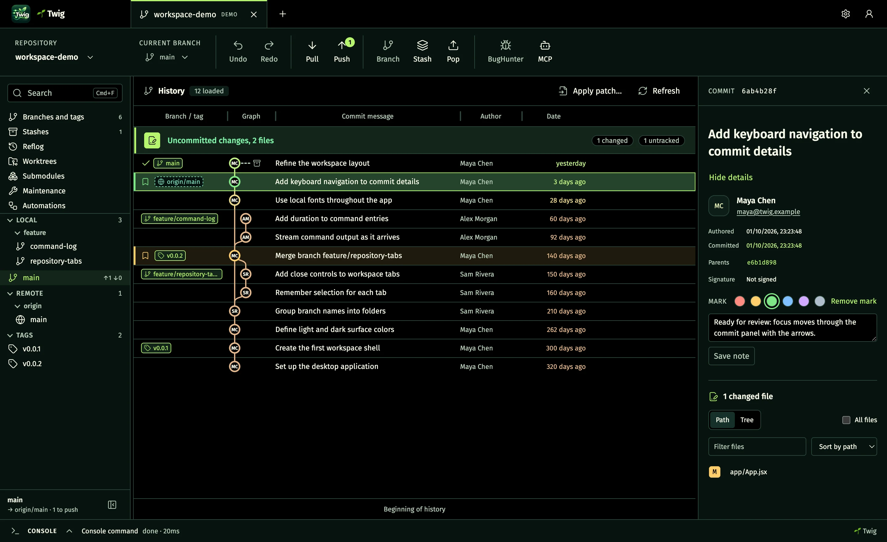
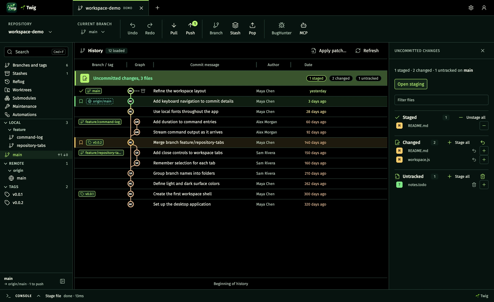
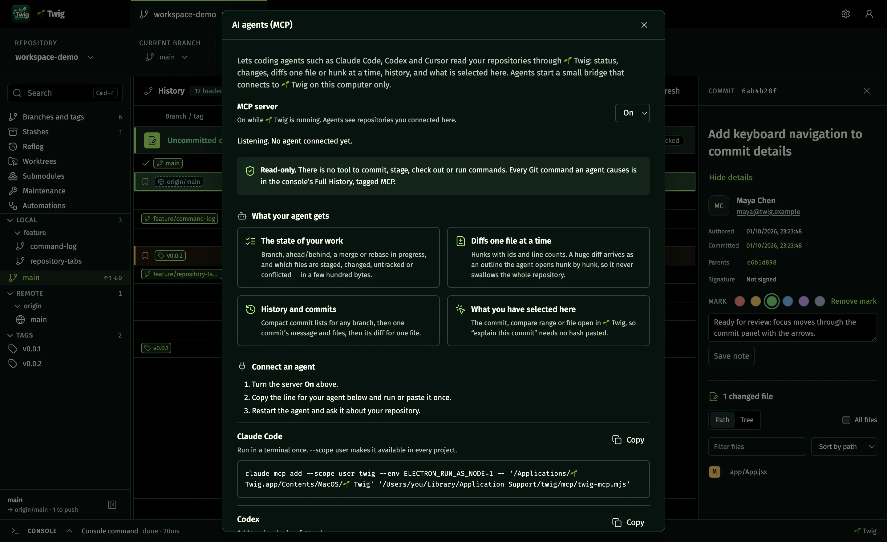
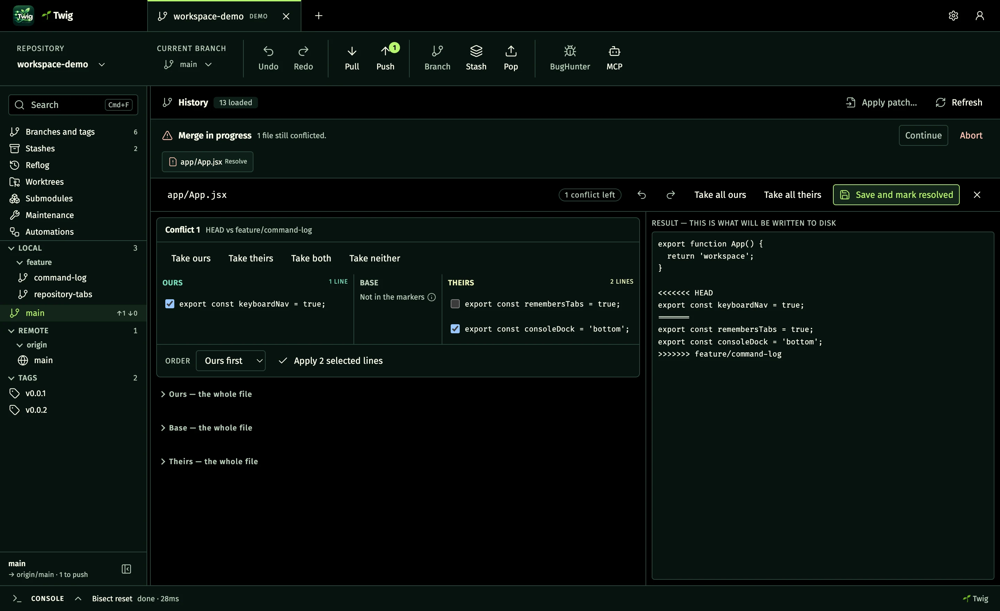
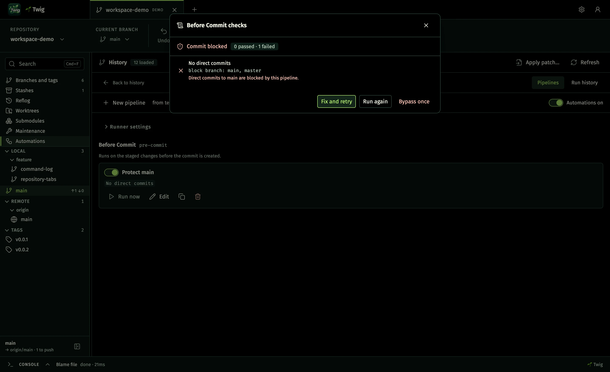
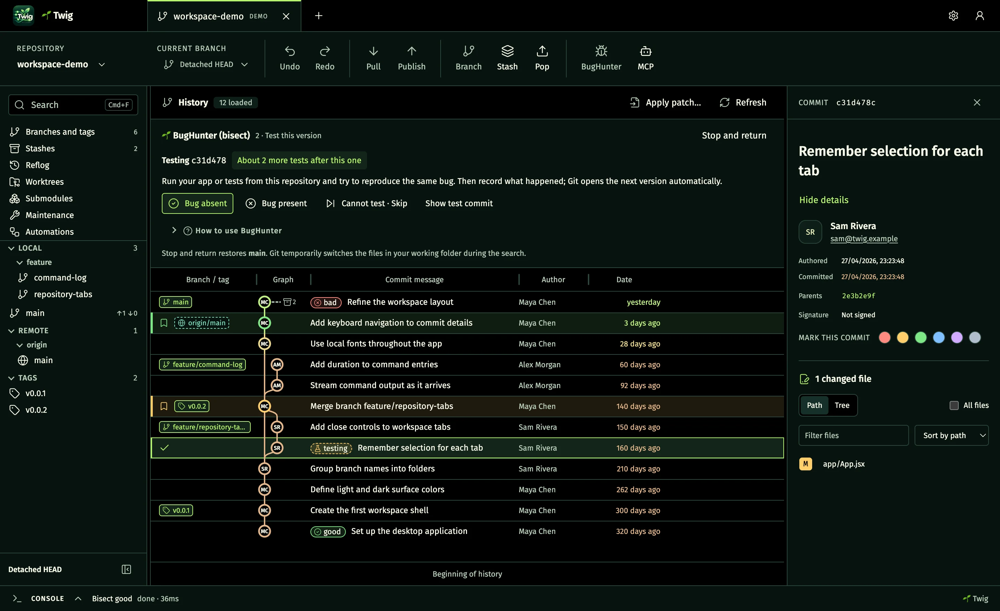
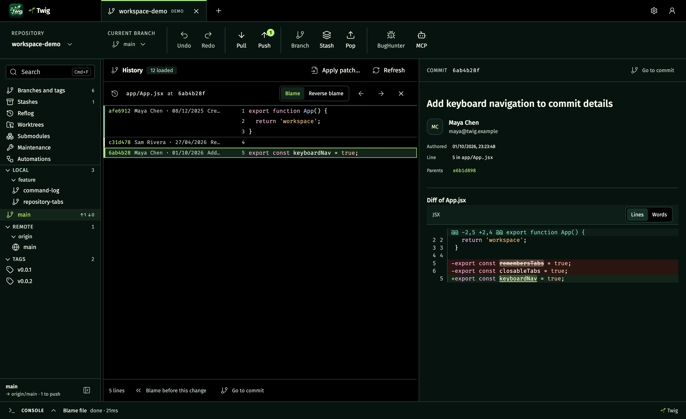
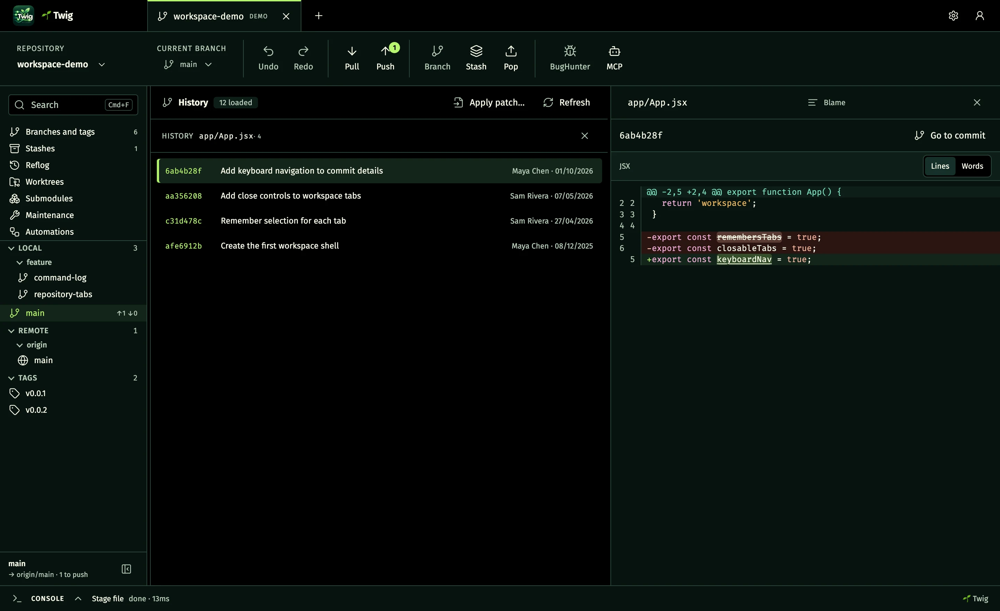
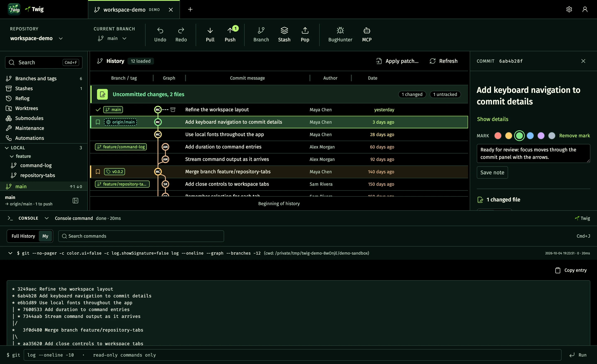

# 🌱 Twig

**A desktop Git client with a built-in MCP server.** You work with the graph,
line-level staging, rebase and Undo. Claude Code, Codex or Cursor connect to the
same repositories over MCP: they see what you selected, spend fewer tokens than
with `git`, and can only *propose* a commit — you press Commit in 🌱 Twig.

**Current version: 0.19.0.** Released 2026-10-10 — see [CHANGELOG.md](CHANGELOG.md).
macOS, Windows and Linux · [Website](https://kitarasenka.github.io/twig/) ·
[Download](https://github.com/kitarasenka/twig/releases/latest) · [MCP docs](docs/mcp.md)

<picture>
  <source media="(prefers-color-scheme: light)" srcset="site/assets/shots/workspace-light.webp">
  
</picture>

## Why 🌱 Twig

An agent can already run `git`. 🌱 Twig gives it only what is cheaper than `git`,
or what `git` can't give at all:

| Task | Agent with `git` | Agent with 🌱 Twig |
| --- | --- | --- |
| When did this code appear or disappear? | `git log -S … -p` — every hunk of every matching file: 3,969–189,272 tokens | `search_history` — the lines around each match: 893–9,202 tokens, **3–63× less** |
| Who changed these lines, and why? | `git blame`, then `git log -1` per commit: 3–9 calls, 5,120–19,922 tokens | `get_blame` — one call, 414–1,017 tokens, **−92…−95 %** |
| What changed? | `git status` + `git diff --stat`: 295–1,112 tokens | `list_changes` — one call, 102–555 tokens, **2–3× less** |
| Explain the commit I'm looking at | you paste the hash | it sees what is selected in 🌱 Twig |
| A 12 MB lock file in the diff | all of it lands in the context | one line: its size and the command that reads it |
| Commit and push | the agent runs them | the agent proposes; you press Commit, and Undo works |
| What you see | the agent's terminal | each request in 🌱 Twig's console, tagged MCP |

Measured with Claude Opus 5.5 on real changes from two repositories, 8–9 October 2026
([method and full tables](https://kitarasenka.github.io/twig/mcp.html#tokens)). To be
fair: diffs aren't compressed, so reading every change for a commit message saves only
4–10 % — mostly by taking 2–5 calls instead of 5–9. Against `git log -S … -p | grep -C3`,
search is still 16–37 % smaller. The six read tools' descriptions cost 2,563 tokens once
per session.

As a Git client, 🌱 Twig keeps you in charge:

- **Nothing hidden.** Every Git command it runs — for you or for the agent — is in the
  console with its exact argv, folder, output, exit code and time.
- **Undo for Git.** Commit, merge, cherry-pick, checkout, stash, even discarded changes
  (copied into Git first). What can't be undone says why.
- **Checks before commit and push** — tests, branch and message rules, a secret scan —
  without hand-written hooks.
- **Local, no account, no telemetry.** The MCP server is off until you turn it on, then
  listens on a private local socket with no network port.

## For the agent: 9 MCP tools

| Tool | Gives the agent |
| --- | --- |
| `get_workspace_context` | branch, upstream, an operation in progress, file counts, the other connected repositories |
| `list_changes` | changed files as `M +2 -1 path`; with `diffs: true`, every patch in one call |
| `get_commit` | the message and every file's patch in one call |
| `search_history` | when code appeared or disappeared (`-S`, `-G`), or commits by message or author — only the lines around each match |
| `get_blame` | runs of lines per commit, each commit's subject once |
| `get_ui_context` | what is open in 🌱 Twig: commit, range, file |
| `propose_commit`, `new_version` | a dialog in 🌱 Twig with the files, the message, a version bump and a tag — you commit, push or cancel |
| `await_commit` | your answer, if you take longer than ~45 s |

Turn it on with **MCP** in the toolbar and copy the ready command for Claude Code, Codex
or Cursor. The bridge runs on 🌱 Twig's own executable, so no Node.js is needed. Tools
read the repository of the agent's working folder, or the one open in 🌱 Twig. Lock files
and huge files arrive as one line with the `git` command that reads them; a file is never
cut in the middle. More: [docs/mcp.md](docs/mcp.md).

## For you: the Git client

- **History** — a virtualized graph that names every branch and tag; search by message,
  hash, author, path or code (`-S`, `-G`); blame, "blame before this change" and reverse
  blame; file history across renames; reflog with lost commits marked and recoverable.
- **Changes** — stage files, hunks or single lines; discard with Undo; amend,
  co-authors, `.gitignore` from the menu.
- **Diffs** — numbered on both sides, intra-line and word modes, syntax highlighting;
  images side by side, swipe, onion skin or difference, with the changed areas boxed.
- **Rewriting history** — a context menu with everything that applies; interactive
  rebase by drag; squash a selection; reword; a three-way conflict editor; drag a branch
  onto another to merge, rebase, cherry-pick or push — the exact commands are shown first.
- **Tools** — 🌱 BugHunter (guided `git bisect`), color marks and notes on commits (local
  only), worktrees, submodules, signed commits, patches, Git LFS, tags, maintenance,
  opt-in background fetch.
- **Automations** — trigger → conditions → actions around commit, push, merge and more,
  for operations run in 🌱 Twig; pipelines from the repository don't run until you
  review them.
- **Everyday** — picks up commits made in a terminal by itself (no polling), a demo
  sandbox that is a real repository, dark and light themes, full keyboard control
  (Cmd/Ctrl + J console, F search, T new tab, W close tab, `,` settings).

## Screenshots

| | |
| --- | --- |
|  |  |
| **Uncommitted changes** — stage and unstage without leaving the graph. | **MCP** — turn it on and copy the command for your agent. |
|  |  |
| **Conflict editor** — pick lines from each side in the order you choose. | **Automations** — a pre-commit pipeline stops a direct commit to `main`. |
|  |  |
| **BugHunter** — a guided `git bisect`. | **Blame** — who changed a line, and the version before that change. |
|  |  |
| **File history** — per-commit diffs of one file, following renames. | **Console** — every command exactly as it ran. |

## Install

[Download](https://github.com/kitarasenka/twig/releases/latest) for macOS (Apple Silicon
or Intel, signed and notarized), Windows x64, Debian / Ubuntu, or any Linux as an
AppImage. Git must be installed. Updates arrive in the app and are checked against the
release's SHA-256. Gentoo: community ebuilds
[`dev-vcs/twig`](https://github.com/vitaly-zdanevich/gentoo-overlay/tree/main/dev-vcs/twig)
and [`dev-vcs/twig-bin`](https://github.com/vitaly-zdanevich/gentoo-overlay/tree/main/dev-vcs/twig-bin)
in [Vitaly Zdanevich's overlay](https://github.com/vitaly-zdanevich/gentoo-overlay#add-the-overlay)
(amd64, glibc).

## Develop

Node 20.19+ and npm:

```sh
npm ci
npm run dev          # Vite + Electron, live reload
npm test             # ESLint and Node checks, many against real Git
npm run test:smoke   # real Electron sessions; needs a desktop session
```

Running, checks, packaging, releases, macOS signing and the landing site:
[docs/development.md](docs/development.md). `PROMPT.md` is the specification,
`CLAUDE.md` the handoff state.

## Security

- The renderer is sandboxed and context-isolated. Git runs only through one logged
  `spawn` executor, never a shell; user automations are the only other process runner —
  also without a shell, logged, with a timeout.
- The console input accepts read-only Git only. Line staging sends line indices and the
  diff's digest, never patch text; commit messages reach Git on stdin.
- MCP is off by default. Turned on, it listens in a folder only your account can open
  (a named pipe on Windows), with no network port, and serves only your connected
  repositories. Reads run with `GIT_OPTIONAL_LOCKS=0`; a commit by the agent needs your
  click.
- Network: Git itself, the update check (at launch and daily in the installed app; it
  can be turned off) and background fetch if you enable it. No telemetry. An installer
  is accepted only from this repository's release with matching size and SHA-256 — on
  macOS, also with our Developer ID signature.

## License

Copyright (c) 2026 Kiryl Tarasenka.

🌱 Twig is distributed under the Functional Source License, Version 1.1, with an
Apache 2.0 future license (`FSL-1.1-ALv2`) — see [LICENSE.md](LICENSE.md). You
may use, modify and redistribute it for any purpose that is not a competing
commercial product or service, and every version becomes Apache 2.0 two years
after it is made available.

That license applies to the commit that introduced it and everything published
after it. Releases up to and including 0.8.5 were published with no license file
and no grant of any kind; [NOTICE.md](NOTICE.md) spells this out. Contributions
are accepted under the [CLA](CLA.md).
